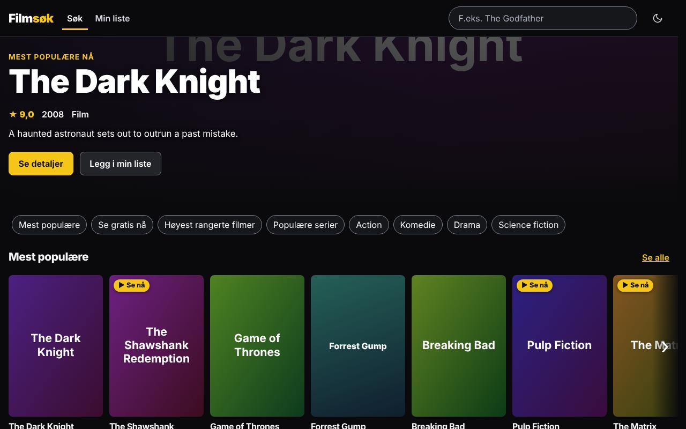
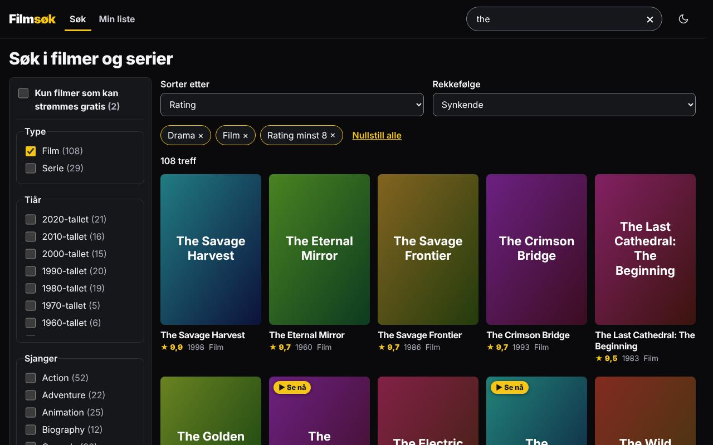
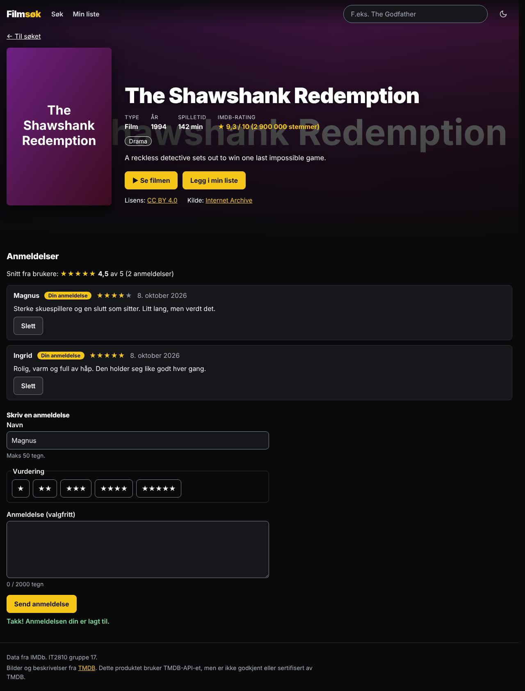
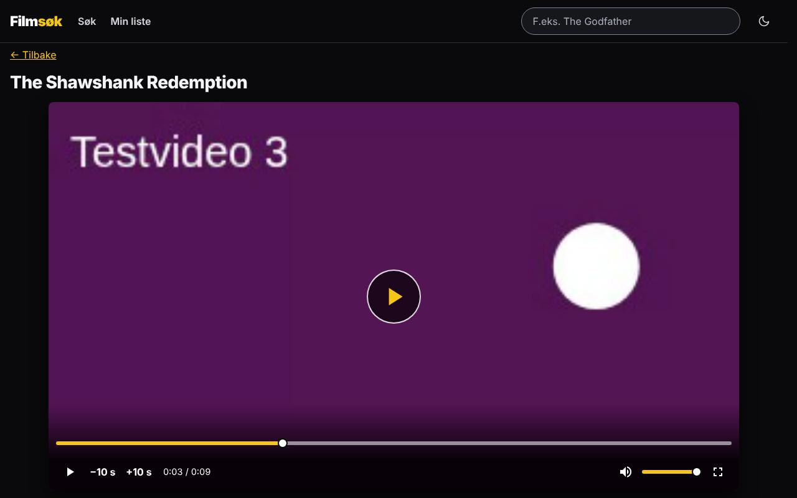
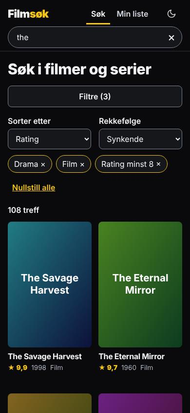
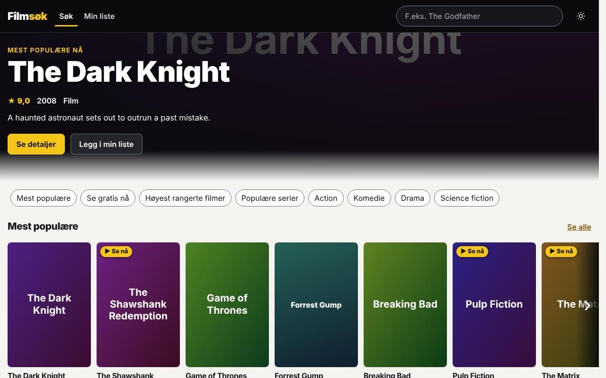

# Filmsøk – IT2810 prosjekt 2, gruppe 17

Søk, filtrer, sorter og anmeld over 190 000 filmer og serier fra IMDb, med plakater fra TMDB og
lovlige gratisfilmer fra Internet Archive som kan spilles direkte i appen.

**Kjørende versjon:** <http://it2810-17.idi.ntnu.no/project2/> (krever NTNU-nett eller VPN).



## Kom i gang

Lokalt, uten VPN. Krever Node.js ≥ 20 og PostgreSQL med contrib-pakken (`pg_trgm`, `unaccent`).

```bash
npm ci
npm run setup    # lager databaser og fyller dem med syntetiske data
npm run dev      # http://localhost:5173/project2/
```

Detaljer, ekte IMDb-data og feilsøking: [`docs/oppsett.md`](docs/oppsett.md#rask-start-2-minutter).
Tester: `npm test` (backend og frontend) og `npm run test:e2e` (Playwright).

## Funksjonalitet

| Krav i oppgaven         | Slik er det løst                                                                                                                     |
| ----------------------- | ------------------------------------------------------------------------------------------------------------------------------------ |
| Søk                     | 300 ms debounce, ingen request for tomt eller uendret søk, uavhengig av store/små bokstaver og aksenter. Korte søk matcher ordstart  |
| Store resultatsett      | Uendelig scroll med «Last flere» som alternativ. Cursor-paginering (keyset) i SQL, 20 per side                                       |
| Detaljer                | Egen side per tittel med handling, sjangre, rating, anmeldelser og eventuell gratisfilm                                              |
| Sortering og filtrering | Sjanger, tiår, type, minste rating og «gratis». Antall treff per valg. Sortering på relevans, rating, år og tittel. Alt skjer i SQL  |
| Brukergenererte data    | Anmeldelser (1–5 stjerner og tekst) og «Min liste», lagret i PostgreSQL. Egne anmeldelser kan slettes                                |
| Tilgjengelighet         | WCAG 2.1 AA, tastatur overalt, `aria-live` for antall treff                                                                          |
| Bærekraft               | Lazy-loading, små bilder, cache og komprimering, mørk modus, få avhengigheter                                                        |
| Design                  | Kinoinspirert, mørkt grensesnitt med lys variant. Bla-modus med rader når søket er tomt, søkemodus med filtre og liste når man søker |

Søketilstanden ligger i URL-en (kan deles og bokmerkes), gratisfilmer spilles i egen spiller med
tastaturstyring og undertekster, og feiltilstander (tomt søk, ingen treff, nettverksfeil, API nede)
har egne meldinger.

|                                                                     |                                                                        |
| ------------------------------------------------------------------- | ---------------------------------------------------------------------- |
|  |  |
|              |                                   |
|                    |                                                                        |

## Arkitektur

```
Nettleser (React + Apollo Client)
   │  GET /project2/…            statiske filer (Vite-bygg), Apache med gzip og cache-headere
   │  POST /project2/graphql ──▶ Apache (reverse proxy) ──▶ Node + GraphQL Yoga :3001 (127.0.0.1)
   │                                                            ├─▶ PostgreSQL (pg_trgm, unaccent)
   │                                                            └─▶ TMDB API (plakater, bufret i DB)
   └─ video ──────────────────────────────────────────────────────▶ archive.org (direkte)
```

```
backend/      GraphQL-skjema, resolvere, søk (src/), migreringer og importskript, API-tester mot PostgreSQL
frontend/     React-app: apollo/ (klient, cache), components/, pages/ (lazy-lastet), hooks/ og lib/
e2e/          Playwright-tester med axe
deploy/       systemd-enhet, Apache-konfig, oppsett- og oppdateringsskript for VM-en
docs/         all dokumentasjon, se docs/README.md
```

## Viktigste valg

Alle valg med begrunnelse: [`docs/beslutninger.md`](docs/beslutninger.md). Hvordan det henger
sammen, steg for steg: [`docs/forklaring.md`](docs/forklaring.md).

- **PostgreSQL med `pg_trgm`, GIN og `unaccent`:** delstrengsøk og aksentfolding er indeksert, og
  målt 3 ms mot 77 ms uten indeks. Tall i [`docs/ytelse.md`](docs/ytelse.md).
- **Cursor (keyset) i stedet for `OFFSET`:** side 1000 er like rask som side 1, og ingen hull eller
  duplikater når data endres.
- **GraphQL (Yoga) med grenser:** klienten henter bare feltene den trenger. Dybde-, kostnads-,
  `first`- og rate-limit samt maskerte feil beskytter API-et ([`docs/forklaring.md`](docs/forklaring.md#5-vern-av-api-et)).
- **Apollo Client og URL som kilde til søketilstand:** deling, bokmerker og tilbake-knappen virker
  uten egen synkronisering.
- **Tilgjengelighet:** fokusstyring ved rutebytte og sletting, ett `role="alert"`-banner ved nedetid,
  axe i E2E på alle sider i lys og mørk modus.
- **Bærekraft:** lazy-lastede ruter og rader, `srcset`, `immutable`-cache, gzip, ingen UI-, spiller-
  eller ORM-bibliotek.
- **Ingen SSR:** en statisk SPA bak Apache er enklere å drifte. Prisen er mobil-Lighthouse på 95–97
  ([begrunnelse](docs/beslutninger.md#hvorfor-ikke-ssr)).

## Testing

| Type                                            | Antall | Kommando           |
| ----------------------------------------------- | -----: | ------------------ |
| API og database (Vitest mot ekte PostgreSQL)    |    482 | `npm test`         |
| Komponenter og hooks (Vitest + Testing Library) |    288 | `npm test`         |
| E2E med axe (Playwright, desktop og mobil)      |    101 | `npm run test:e2e` |

Typisk bruk testes som hele flyter (søk, filtrer, scroll, anmeld, spill film med tastatur). Utypisk
bruk testes eksplisitt: tomt søk, ingen treff, spesialtegn og SQL-injeksjon, veldig lange strenger,
ugyldige cursorer, samtidige kall, nettverksfeil og database nede. Oppsettet er beskrevet i
[`docs/forklaring.md`](docs/forklaring.md#9-testoppsett).

## Deploy på VM

Backend og database kjører direkte på `it2810-17.idi.ntnu.no` uten Docker: PostgreSQL, Node som
systemd-tjeneste på port 3001 og Apache som serverer frontend under `/project2`. Oppdatering:
`ssh -t <bruker>@it2810-17.idi.ntnu.no bash T17-Project2/deploy/oppdater.sh`. Se
[`docs/deploy.md`](docs/deploy.md).

## Prosess og KI

Prosjektet er utviklet med Claude Code som KI-assistent, styrt av reglene i [`CLAUDE.md`](CLAUDE.md)
og planen i [`docs/prosess/plan.md`](docs/prosess/plan.md). Hva KI-en har laget, hva vi har
bestemt og kontrollert selv, og hvilke feil KI-en gjorde, står i
[`docs/ki/ki-deklarasjon.md`](docs/ki/ki-deklarasjon.md). Arbeidet er gjort på egne grener med
issues og PR-er med review, se [`docs/prosess/grener-og-pr.md`](docs/prosess/grener-og-pr.md).

## Arbeidsfordeling

| Navn    | Ansvarsområde                                                        |
| ------- | -------------------------------------------------------------------- |
| Nicolay | Prosjektleder. Arkitektur, GraphQL-API og React, frontend og backend |
| Sturla  | Backendansvarlig: database, import og resolvere                      |
| Brage   | Frontendansvarlig: komponenter, design og tilgjengelighet            |
| Daniel  | Testansvarlig: enhets-, komponent- og E2E-tester                     |

Mye av koden er skrevet av KI-agenter styrt av gruppa (se [Prosess og KI](#prosess-og-ki)),
så git-historikken viser ikke hvem som har vurdert, testet og godkjent hva. Den enkeltes bidrag er
beskrevet i egen fil i Canvas.

## Kjente begrensninger

- **Ingen innlogging:** anmeldelser og liste følger nettleseren via en anonym ID.
- **Korte søk (1–2 tegn)** matcher bare starten av ord, av hensyn til ytelsen.
- **Vanlige ord** som «the» med relevanssortering tar ca. 140 ms.
- **Ytelsestallene** er målt på syntetiske data (120 000 titler), ikke det ekte datasettet.
- **Rate limiting ligger i minnet** og nullstilles ved omstart.
- **VM-en kjører http, ikke https:** Lighthouse Best Practices blir lavere, og brotli og HTTP/2 mangler.
- **Klient-rendret (ingen SSR):** mobil Performance stopper på 95–97.

## Mer dokumentasjon

Indeks over all dokumentasjon: [`docs/README.md`](docs/README.md).

_Bilder og beskrivelser fra TMDB. Produktet bruker TMDB-API-et, men er ikke godkjent eller
sertifisert av TMDB. Filmer fra Internet Archive vises med lisens og kilde under spilleren._
